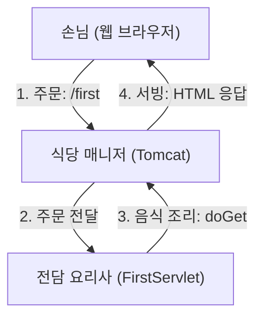

# FirstServlet 학습 가이드

이 문서는 [FirstServlet.java](file:///C:/workspace/servlet/src/main/java/org/example/servlet/FirstServlet.java)의 동작 원리를 3단계(초심자 비유, 중급자 메커니즘, 면접 질문)로 나누어 설명합니다.

---

## 1. 초심자용 실생활 비유 (식당 시스템)

웹 서버와 서블릿의 관계는 **식당**에 비유하면 아주 쉽습니다.



* **손님 (Client / Web Browser):** `http://localhost:8080/first` 주소를 주창 창에 입력해 요청을 보내는 존재입니다. 식당에 와서 메뉴를 주문하는 손님과 같습니다.
* **식당 매니저 (Servlet Container / Tomcat):** 손님이 들어오는 문을 관리하고 주문을 받아 적절한 요리사에게 배정하는 존재입니다.
* **메뉴 이름 (`@WebServlet("/first")`):** 손님이 주문표에 적는 메뉴 코드입니다. 매니저는 이 이름을 보고 어떤 요리사에게 주문을 넣을지 결정합니다.
* **전담 요리사 (FirstServlet):** 해당 메뉴 주문을 전담해서 처리하는 요리사입니다.
* **주문서 (`HttpServletRequest req`):** 손님이 작성한 구체적인 주문 사항입니다. (예: "맵게 해주세요", "오이 빼주세요"와 같이 사용자가 보낸 파라미터나 헤더 정보가 담겨 있습니다.)
* **음식 접시 (`HttpServletResponse resp`):** 요리사가 음식을 담아 손님에게 돌려보낼 접시입니다. 요리사는 이 접시에 맛있는 음식(HTML 태그 및 데이터 text)을 올려서 매니저에게 전달합니다.
* **`doGet` 메서드:** 손님이 음식을 **가져다 달라고 요청(GET)**했을 때 작동하는 요리사만의 요리 레시피(행동 지침)입니다.

---

## 2. 중급자용 내부 동작과 기술 특징

### 2.1 실제 일어나는 프로세스 (Request Flow & Lifecycle)
1. **요청 수신:** 클라이언트가 `http://localhost:8080/first`로 GET 요청을 보내면, WAS(Tomcat)의 Connector가 이를 수신합니다.
2. **객체 생성:** 컨테이너는 HTTP 요청 메시지를 파싱하여 `HttpServletRequest` 객체를 만들고, 응답을 기록할 빈 `HttpServletResponse` 객체를 동적으로 생성합니다.
3. **매핑 및 매칭:** `@WebServlet("/first")` 설정을 기반으로 컨테이너 메모리에 로드된 `FirstServlet` 인스턴스를 찾습니다.
   > [!NOTE]
   > 서블릿은 기본적으로 **싱글톤(Singleton)** 패턴으로 관리됩니다. 첫 요청 시에만 인스턴스가 생성(Lazy Loading)되어 재사용됩니다.
4. **서비스 메서드 실행:** 컨테이너는 스레드 풀에서 스레드를 하나 할당하여 서블릿의 `service(req, resp)` 메서드를 호출합니다.
5. **doGet 라우팅:** `service()` 메서드는 HTTP Method가 `GET`임을 판단하고, 내부적으로 개발자가 오버라이딩한 `doGet(req, resp)` 메서드로 분기시킵니다.
6. **응답 전송:** `doGet()` 내부에서 `resp.getWriter().println()`을 통해 출력 스트림에 데이터를 기록하면, 컨테이너가 이 내용을 HTTP 응답 메시지 바디에 실어 클라이언트에게 전송하고 스레드와 요청/응답 객체를 소멸(반환)시킵니다.

### 2.2 의존성 및 핵심 클래스 (Dependencies)
* **`jakarta.servlet-api`:** 서블릿 명세(Interface)를 정의한 API로, 빌드 시에만 컴파일러가 참고하고 실행 시에는 WAS(Tomcat) 내부의 라이브러리를 사용하므로 Maven 스코프가 `provided`로 설정되어 있습니다.
* **`HttpServlet`:** HTTP 프로토콜에 특화된 서블릿을 만들기 위해 상속해야 하는 추상 클래스입니다.
* **`HttpServletRequest`:** HTTP 요청 헤더, 쿠키, 세션, 파라미터 등 클라이언트가 보낸 데이터를 조회할 수 있는 인터페이스입니다.
* **`HttpServletResponse`:** HTTP 상태 코드 설정, 응답 헤더 추가, content-type 설정, 응답 바디 출력을 위한 `PrintWriter` 스트림 등을 제어하는 인터페이스입니다.

### 2.3 문법 및 구현 특징
* **`@WebServlet("/first")` 어노테이션:** 과거 `web.xml` 배포 서술자 파일에 일일이 등록해야 했던 서블릿 매핑 정보를 자바 클래스 선언부에 직접 명시하여 생산성을 높였습니다.
* **MIME 타입 및 인코딩 지정:**
  ```java
  resp.setContentType("text/html; charset=utf-8");
  ```
  브라우저에게 응답 데이터가 HTML 문서임을 알리고 UTF-8 문자셋을 적용하여 한글이 깨지는 현상을 방지합니다. 반드시 `getWriter()`를 호출하기 전에 선언해야 적용됩니다.
* **`super.doGet()` 제거:**
  부모 클래스인 `HttpServlet`의 `doGet` 기본 구현체는 HTTP `405 Method Not Allowed` 에러를 반환하도록 설계되어 있으므로, 직접 응답을 작성할 때는 `super.doGet(req, resp)` 호출 코드를 **반드시 주석 처리하거나 제거**해야 합니다.

---

## 3. 면접 대비 예상 질문 (Q&A)

### Q1. 서블릿(Servlet)의 생명주기(Life Cycle)에 대해 설명해 주세요.
> **답변:** 
> 서블릿의 생명주기는 크게 **초기화 -> 요청 처리 -> 소멸**의 3단계로 진행되며 서블릿 컨테이너가 제어합니다(IoC).
> 1. **`init()`:** 첫 요청이 들어왔을 때(혹은 설정에 따라 서버 기동 시) 최초 1회만 호출되어 서블릿 인스턴스를 초기화합니다.
> 2. **`service()`:** 클라이언트 요청이 올 때마다 호출되며, 요청 방식(GET, POST 등)을 분석해 `doGet()`, `doPost()` 등으로 호출을 분기합니다.
> 3. **`destroy()`:** 서블릿 컨테이너가 종료되거나 웹 애플리케이션이 언로드될 때 1회 호출되어 자원을 해제합니다.

### Q2. 서블릿은 멀티스레드 환경에서 안전(Thread-Safe)한가요?
> **답변:** 
> **아닙니다.** 서블릿 컨테이너는 하나의 서블릿 클래스에 대해 **단 하나의 인스턴스(싱글톤)**만 생성하고, 멀티스레드 방식으로 여러 요청을 처리합니다. 따라서 서블릿 내부에서 객체 변수(필드, 인스턴스 변수)를 선언하여 상태를 공유하고 값을 수정할 경우 **동시성(Concurrency) 문제**가 발생할 수 있습니다. 
> 그러므로 서블릿 내부에서는 상태 값을 저장하는 인스턴스 변수를 지양하고, 메서드 내의 **지역 변수(Local Variable)**만 사용하여 Thread-safe하게 코드를 설계해야 합니다.

### Q3. `@WebServlet` 어노테이션이 지원되기 시작한 서블릿 버전과 기존 `web.xml` 방식 대비 장점은 무엇인가요?
> **답변:** 
> **Servlet 3.0(Java EE 6)** 명세부터 어노테이션 방식 설정이 지원되기 시작했습니다.
>기존 `web.xml` 방식은 매번 서블릿을 만들 때마다 XML 코드를 장황하게 추가해야 해서 설정 오류가 발생하기 쉽고 관리가 까다로웠습니다. 반면 `@WebServlet`을 사용하면 해당 자바 파일 내부에서 매핑 주소를 직관적으로 파악할 수 있고 선언이 간결해지는 장점이 있습니다.

### Q4. GET 요청을 처리할 때 `super.doGet(req, resp)` 호출을 지워야 하는 이유는 무엇인가요?
> **답변:** 
> `HttpServlet` 추상 클래스의 `doGet` 기본 메소드는 해당 주소로 GET 요청이 들어오는 것을 기본적으로 지원하지 않는 형태(`405 Method Not Allowed`)의 예외 응답을 클라이언트에 전송하도록 미리 작성되어 있습니다. 따라서 우리가 재정의한 로직으로 정상 응답을 내려주려면 부모의 오리지널 메소드를 실행시키는 `super.doGet` 호출을 제거해야 합니다.
